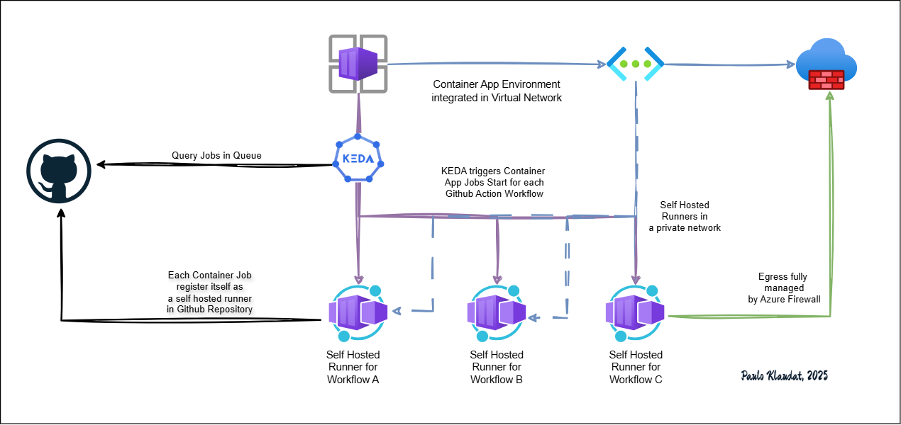

# Self-Hosted GitHub Runners on Azure Container Apps

This repository contains Terraform code to deploy self-hosted GitHub runners using **Azure Container Apps**. The container apps are integrated into a **Virtual Network (VNet)**, where **egress traffic is routed through Azure Firewall** for secure outbound communication.


## 🚀 Features

- **Self-hosted GitHub Runners** deployed as Container Apps
- Secure **Virtual Network integration**
- **Azure Firewall** as the egress point for all outbound traffic
- Configurable runner image, GitHub token, and repo/organization binding
- Modular and reusable Terraform setup

## 📦 Components

- **Azure Container Apps**: Hosts the runner containers
- **Azure VNet and Subnets**: Provides network isolation
- **Azure Firewall**: Secures outbound traffic
- **Log Analytics**: Collects container logs
- **User Assigned Managed Identity**: For fine-grained access control - runners to azure

## 🔧 Prerequisites

- Terraform >= 1.7.0
- Azure CLI authenticated
- GitHub PAT (Personal Access Token) with `repo` permissions
- GitHub repository or organization access to register the runner


## ⚙️ Usage

1. **Clone the repository**

```bash
git clone https://github.com/pklaudat/github-actions-azure-runners.git
cd github-actions-azure-runners


